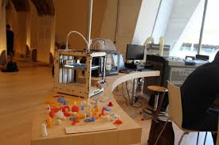

## My Fablab Documentation

### What is a fablab?
A fab lab (fabrication laboratory) is a small-scale workshop offering digital fabrication.

A fab lab is typically equipped with an array of flexible computer-controlled tools that cover several different length scales and various materials, with the aim to make "almost anything". This includes technology-enabled products generally perceived as limited to mass production.

### Syllabus

Day 1
* Indroduction To Fablab()
* Github Pages and Documentation()

Day 3

3D Printing

First 3D Model

Hanging Bag Case and Holder for Charging Cell Phone

Dice-Rough Work

Octopus Mobile Stand

Day 4

Laser Cutting

Keychain Design

Engraving

Day 5

Vinyl Cutting

Sticker Making

Text Cutting

Day 6

Indroduction to Eagle

Electronics Production

PCB Milling(Shopbot)

Day 7

Screen Printing

T-Shirt Printing

Casting & Moulding

Ring Shape Mould

